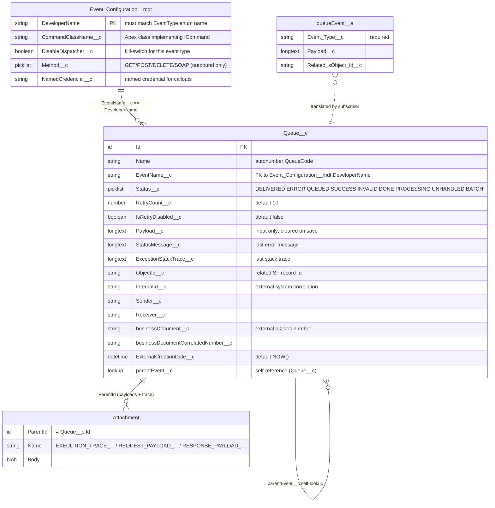
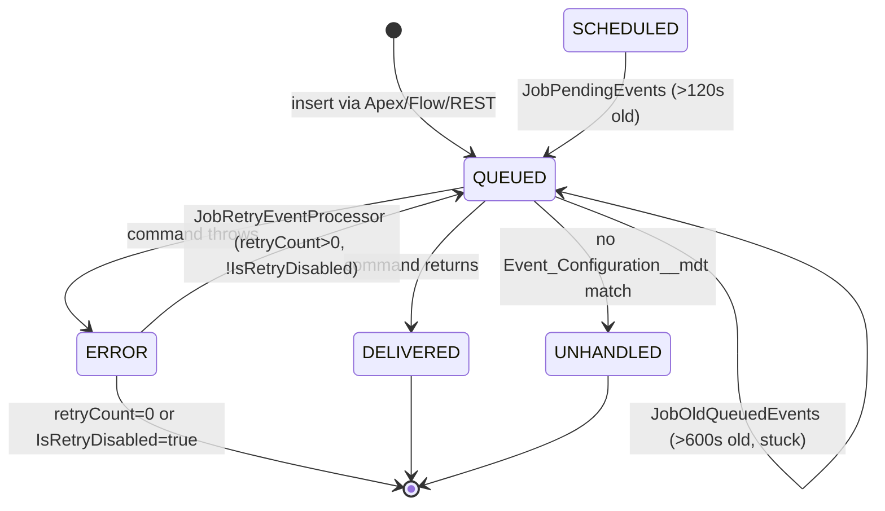

# Data Model

The framework's persistence surface is intentionally tiny: one custom
object for events, one platform event, one custom metadata type for
configuration, plus standard `Attachment` records for payload storage.

## `Queue__c` (the event)

Label **Event Queue**, API name `Queue__c`. Name field is an
autonumber (`QueueCode`, format `{0000000000}`). Sharing model
`ReadWrite`, history tracking enabled on most fields.

### Field inventory

| API name | Type | Required | Default | Description |
| --- | --- | --- | --- | --- |
| `EventName__c` | Text(100) | **yes** | — | Event type key. Must match an `Event_Configuration__mdt.DeveloperName` for the event to be dispatched. |
| `Status__c` | Picklist | no | — | Lifecycle state. Picklist values: `DELIVERED`, `ERROR`, `QUEUED`, `SUCCESS`, `INVALID`, `DONE`, `PROCESSING`, `UNHANDLED`, `BATCH`. The Apex enum `EventQueueStatusType` is broader — see [../reference/status-lifecycle.md](../reference/status-lifecycle.md). |
| `RetryCount__c` | Number(3,0) | no | 10 | Remaining technical-error retries. Decremented by `EventQueue.decreaseRetry()`. Floor 0. |
| `IsRetryDisabled__c` | Checkbox | no | false | Hard kill-switch. Set to true on `IntegrationBusinessException`. `JobRetryEventProcessor` filters this out. |
| `Payload__c` | LongText(131072) | no | — | Input channel. `EventQueue.init()` reads this, copies it to an Attachment, and clears the field. |
| `StatusMessage__c` | LongText(32000) | no | — | Last status/error message. Set by `errorProcessingEvent(e)` to `e.getTypeName() + ' : { ' + e.getMessage() + ' }'`. Cleared on success. |
| `ExceptionStackTrace__c` | LongText(32000) | no | — | `e.getStackTraceString()`. Cleared on success. |
| `ObjectId__c` | Text(50), externalId | no | — | The Salesforce record the event acts on (Order Id, Account Id, etc.). |
| `InternalId__c` | Text(255) | no | — | Free-form correlation id from an external system. |
| `Sender__c` | Text(255) | no | — | Source system. `EventBuilder.createOutboundEventFor` defaults to `SALESFORCE`. |
| `Receiver__c` | Text(255) | no | — | Target system / account. |
| `businessDocument__c` | Text(255), externalId | no | — | External business document number (order number, booking reference, etc.). |
| `businessDocumentCorrelatedNumber__c` | Text(255) | no | — | Secondary correlation number (e.g. original PO vs amended PO). |
| `ExternalCreationDate__c` | DateTime | no | `NOW()` | Source system timestamp. Used to preserve sequence across systems. |
| `parentEvent__c` | Lookup(Queue__c, SetNull) | no | — | Self-lookup to a parent event; relationship name `correlateds`. Used for chained/related events. |

### Object-level metadata

- Compact layout: `SYSTEM`.
- Sharing: Private external, ReadWrite internal.
- Enabled: activities, history, reports, search, streaming API, bulk API.
- Search layout surfaces: `EventName__c`, `businessDocument__c`,
  `InternalId__c`, `Status__c`, `StatusMessage__c`, `CREATED_DATE`,
  `LAST_UPDATE`.
- List views: `All`, `AllToday`.
- Web link: `Delete` (custom list-view action).

## `Event_Configuration__mdt` (the mapping table)

Custom metadata type. One row per Event Type. The row's
`DeveloperName` (and `Label`, by convention) **must** match
`Queue__c.EventName__c` for the dispatcher to resolve it.

| Field | Type | Notes |
| --- | --- | --- |
| `CommandClassName__c` | Text(40), DeveloperControlled | Fully qualified Apex class name. Resolved via `Type.forName(...)`. Must implement `ICommand`. |
| `DisableDispatcher__c` | Checkbox | Kill switch. When true, `EventQueue.isRequestDisabled()` returns true; the packaged dispatcher does not currently short-circuit on this flag, so it is effectively a hint for custom commands (see [improvements.md](../improvements.md)). |
| `Method__c` | Picklist (POST default, GET, DELETE, SOAP), restricted | HTTP method used by `BaseRestProxy.setup()`. Outbound commands only. |
| `NamedCredencial__c` | Text(40), DeveloperControlled | Developer name of a Named Credential. `BaseRestProxy.setup()` sets the endpoint to `callout:<name>`. |

### Shipped configurations

| DeveloperName | CommandClassName | NamedCredential | Method | Notes |
| --- | --- | --- | --- | --- |
| `BOOK_INBOUND_SERVICE` | `BookInboundCommand` | — | — | Inbound. Command class is **not** included in the package. |
| `BOOK_OUTBOUND_SERVICE` | `BookOutboundCommand` | `BookOutboundHeroku` | POST | Outbound. Command class is **not** included in the package. |
| `PARK_OUTBOUND_SERVICE` | `ParkOutboundCommand` | — | POST | Outbound. Command class is **not** included. |
| `EventUnitTest` | `EventUnitTestCommand` | `BookOutboundHeroku` | POST | Test fixture. Command is a no-op `@IsTest` class. |
| `EventUnitTestThrowsException` | `MockThrowsExeceptionCommand` | — | POST | Test fixture that always throws. |

The three "real" configurations (`BOOK_*`, `PARK_*`) reference command
classes that are **not** present in the package source. They are
stubs meant to be overridden in a subscriber org — see
[improvements.md](../improvements.md).

## `queueEvent__e` (the platform event)

| Attribute | Value |
| --- | --- |
| Event Type | `HighVolume` |
| Publish Behavior | `PublishAfterCommit` |
| Subscriber | `queueProcessor.trigger` (ships empty) |

Fields:

| Field | Type | Required | Description |
| --- | --- | --- | --- |
| `Event_Type__c` | Text(255) | yes | The event-type key. Mirrors `Queue__c.EventName__c`. |
| `Payload__c` | LongText(131072) | no | Serialised business payload. |
| `Related_sObject_Id__c` | Text(18) | no | Optional pointer to a record in the producer org. |

## Attachments (payload + trace storage)

Attachments are used in preference to files (`ContentVersion`) because
they are trivially inserted alongside the parent `Queue__c` with no
junction records. Every attachment has:

- `ParentId = Queue__c.Id`
- `Name = <Title>.txt` where `Title` is one of:
  - `EXECUTION_TRACE_<timestamp>_<businessDocument>` — the processing
    log accumulated via `event.log(...)`.
  - `REQUEST_PAYLOAD_<timestamp>` — outbound request body (serialised
    to JSON in `AbstractOutboundCommand.execute()`).
  - `RESPONSE_PAYLOAD_<timestamp>` — raw HTTP response body (stored
    by `RestProxy.postSend()`).
  - Free-form title when the producer attached via
    `event.addPayload(name, content)`.
- `ContentType = 'txt'`
- `Body = Blob.valueOf(string)`

The enum `EventQueueFileTitle` documents the canonical prefixes but is
not currently enforced.

## Status lifecycle at a glance

The `SUCCESS`, `DONE`, `INVALID`, `PROCESSING`, `BATCH` picklist
values are declared but **not** set by the packaged dispatcher — they
are either legacy or extension points. See
[../reference/status-lifecycle.md](../reference/status-lifecycle.md).
