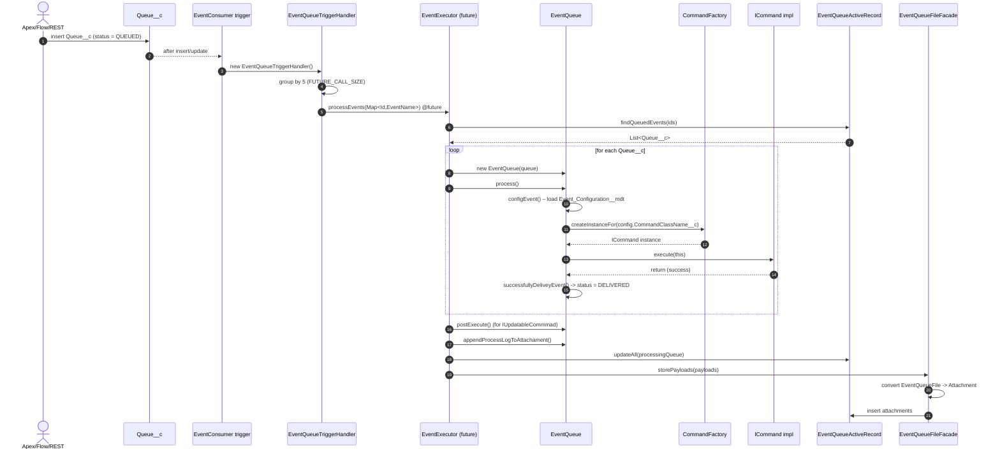
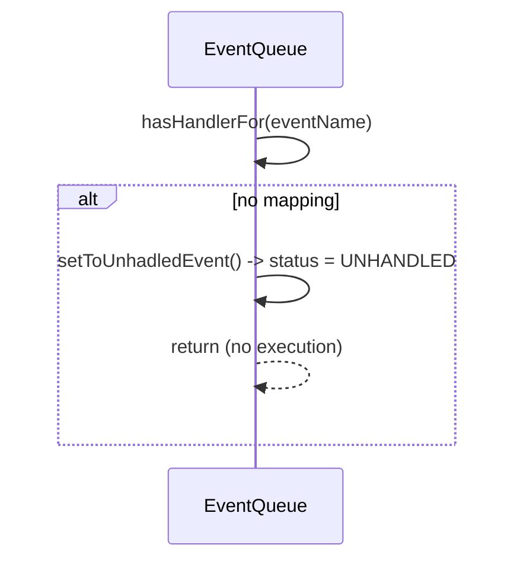
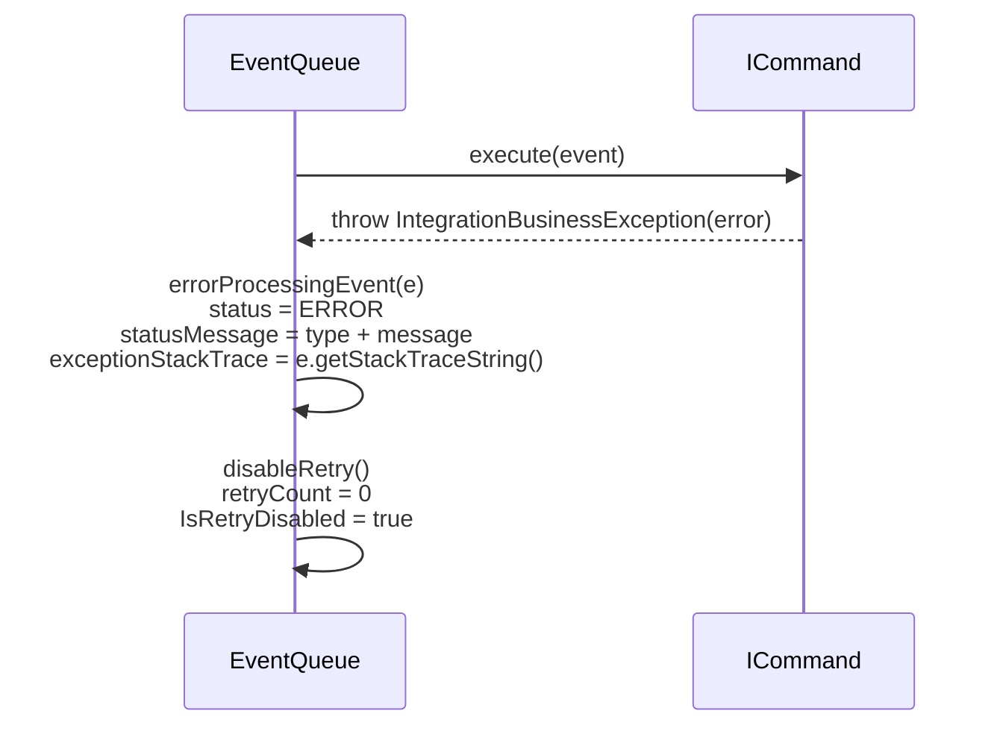
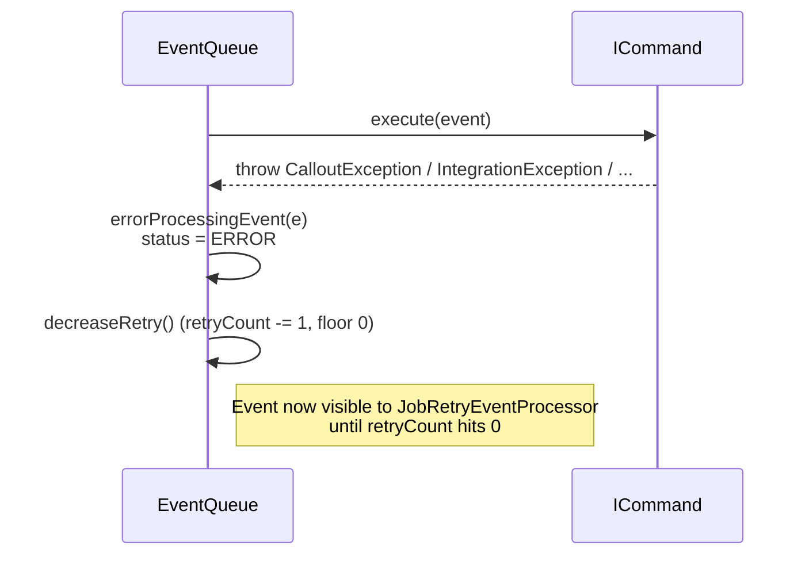
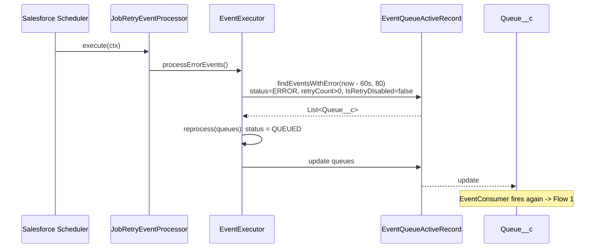
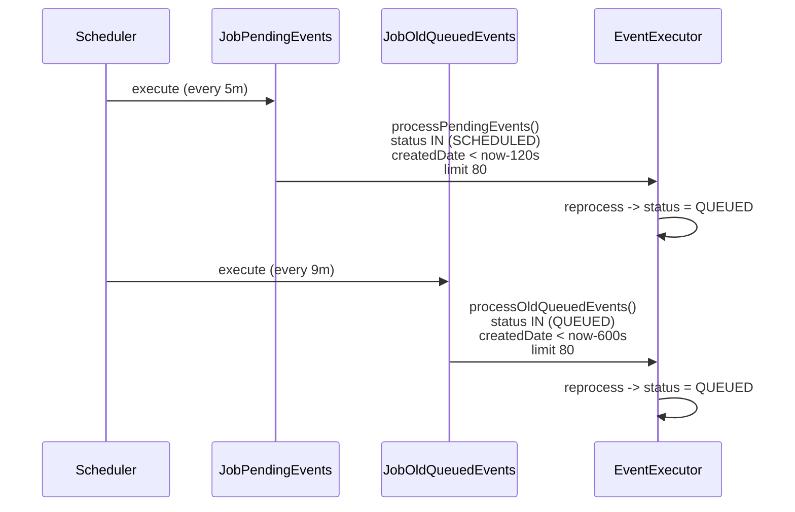
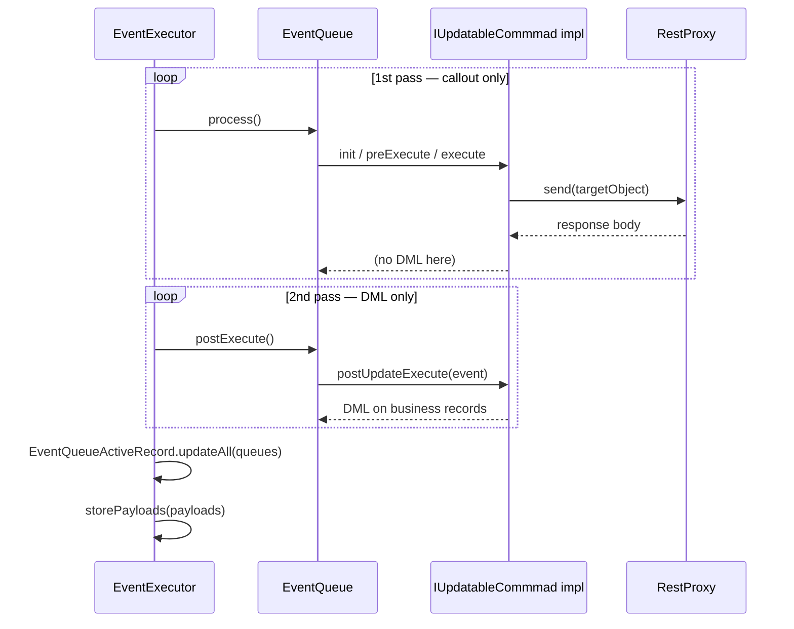
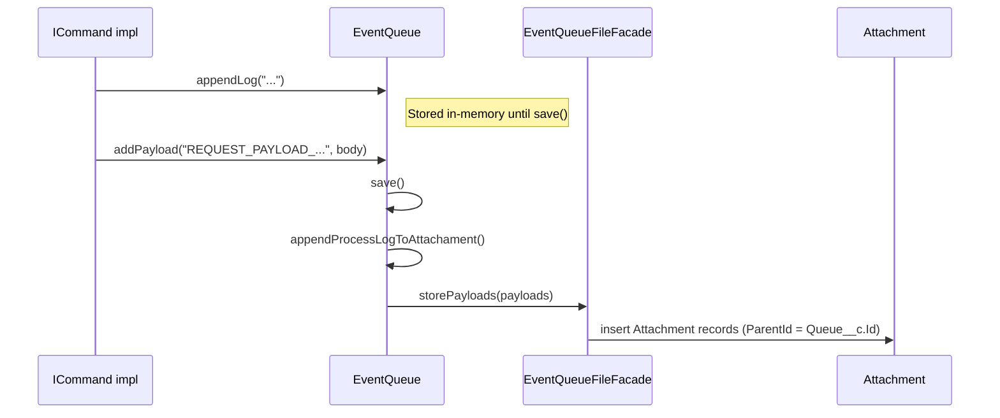
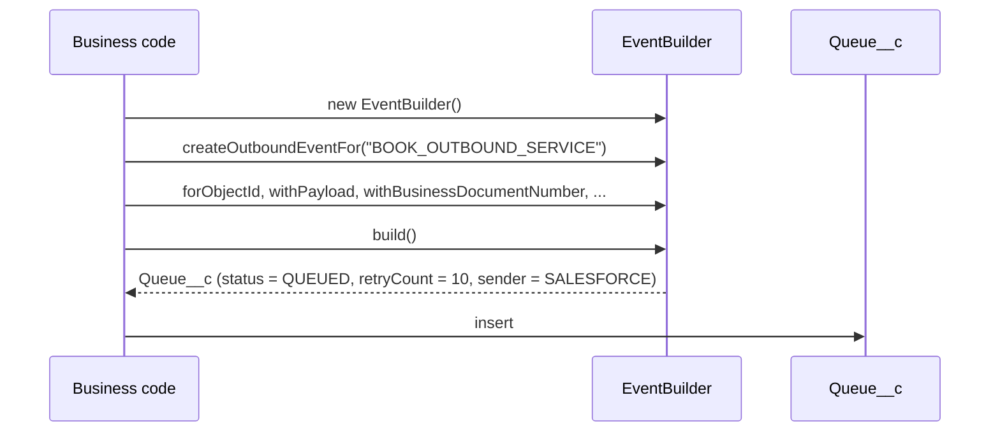

# Execution Flows

Every way an event can enter, be processed, retried, or fail is drawn
below as a sequence diagram. Use this page as the canonical reference
when tracing a real-world record through the system.

## Flow 1 — Synchronous enqueue and dispatch (happy path)

A caller (Apex, Flow, REST) inserts/updates a `Queue__c` with
`Status__c = QUEUED`. The trigger fires, batches events, and hands
them to a `@future(callout=true)` method which runs the configured
command.



Key numbers:

- Batch size in the trigger: **5** (`EventExecutor.FUTURE_CALL_SIZE`).
- Dequeue batch size in scheduled context: **30**
  (`EventQueue.DEQUEUE_QUEUED_BATCH_SIZE`).
- `@future(callout=true)` is used so the command can make HTTP
  callouts independent of the user's transaction.

## Flow 2 — UNHANDLED event

If `Event_Configuration__mdt` does not contain a row whose label
matches `EventName__c`, the event is not dispatched; it's parked in
`UNHANDLED`.



`UNHANDLED` events are **not** picked up by the retry loop — the
retry jobs only look at `SCHEDULED`, stuck `QUEUED`, or `ERROR`
statuses.

## Flow 3 — Business failure (non-retryable)

When the command throws `IntegrationBusinessException`, the framework
permanently parks the event.



The scheduled retry job `JobRetryEventProcessor` filters
`IsRetryDisabled = false`, so this event is now effectively frozen and
requires human intervention.

## Flow 4 — Technical failure (retryable)

Any other exception (generic `Exception`, `CalloutException`,
`IntegrationException`) is treated as transient.



## Flow 5 — Scheduled retry of ERROR events

Every 8 minutes (cron generated by `ScheduleHelper`), the retry job
finds errored events with retries remaining and pushes them back to
`QUEUED`, which retriggers the consumer.



## Flow 6 — Scheduled cleanup of stuck events

Two additional jobs handle events that never got a chance to run:

- `JobPendingEvents` (every 5 min): events in `SCHEDULED` status older
  than 120 seconds → requeue.
- `JobOldQueuedEvents` (every 9 min): events in `QUEUED` status older
  than 600 seconds → requeue (they likely failed to trigger, e.g.
  due to concurrent transaction limits).



## Flow 7 — Outbound command with IUpdatableCommmad (two-phase)

Some commands need to make a callout **and** update a record based on
the response. Apex doesn't allow DML before a callout, so the
framework runs callouts first and then walks the list a second time
to apply updates.



`AbstractOutboundCommand` implements the **callout half** of this
flow: `init` builds a `RestProxy` from `event.config.NamedCredencial__c`,
`preExecute` calls `tranformToSend()`, `execute` sends and logs
`REQUEST_PAYLOAD_*` / `RESPONSE_PAYLOAD_*` attachments, and
`postExecute` delegates to `processResult(responseObject)`. It does
**not** currently implement `IUpdatableCommmad`; subclasses opt in by
declaring `implements IUpdatableCommmad` themselves.

## Flow 8 — Platform event ingestion (high volume)

A producer (usually an external system or a `EventBus.publish(...)`
call) publishes a `queueEvent__e`. The packaged `queueProcessor`
trigger is an empty shell — the expected extension is to translate
each platform event into a `Queue__c` `QUEUED` row.

```mermaid
sequenceDiagram
    actor P as Producer
    participant PE as queueEvent__e
    participant Sub as queueProcessor trigger
    participant Q as Queue__c
    participant Trg as EventConsumer
    participant EX as EventExecutor

    P->>PE: EventBus.publish(queueEvent__e)
    PE-->>Sub: after insert
    Note over Sub: Package ships it empty;<br/>subscriber code converts<br/>Event_Type__c + Payload__c<br/>into Queue__c row
    Sub->>Q: insert Queue__c (status = QUEUED)
    Q-->>Trg: after insert
    Trg->>EX: processEvents(...) @future
```

See [usage/platform-events.md](../usage/platform-events.md) for a
concrete subscriber implementation.

## Flow 9 — Processing log & attachments

Every call to `event.log(...)` / `event.appendLog(...)` pushes a line
onto an in-memory `List<String>`. When the event is saved, the list is
concatenated and stored as an Attachment named
`ExecutionTrace_<timestamp>_<businessDocument>`. In addition, outbound
commands attach `REQUEST_PAYLOAD_<timestamp>` and
`RESPONSE_PAYLOAD_<timestamp>` files.



## Flow 10 — Direct construction via EventBuilder

Application code can build and enqueue events in-process without
crafting SObject records manually:



`EventBuilder.buildAndSave()` is a convenience shortcut that wraps
`new EventQueue(queue).save()` and returns the `EventQueue` for
further manipulation.

## Where each flow is implemented (file map)

| Flow | File(s) |
| --- | --- |
| 1 — Sync dispatch | `EventConsumer.trigger`, `EventQueueTriggerHandler.cls`, `EventExecutor.cls`, `EventQueue.process()` |
| 2 — UNHANDLED | `EventQueue.hasHandlerFor`, `setToUnhadledEvent` |
| 3 — Business error | `EventQueue.process()` catch of `IntegrationBusinessException`, `disableRetry()` |
| 4 — Technical error | `EventQueue.process()` catch of generic `Exception`, `decreaseRetry()` |
| 5 — Retry loop | `JobRetryEventProcessor.cls`, `EventExecutor.processErrorEvents` |
| 6 — Stuck events | `JobPendingEvents.cls`, `JobOldQueuedEvents.cls`, `EventExecutor.process{Pending,OldQueued}Events` |
| 7 — Two-phase | `EventQueue.postExecute()`, `IUpdatableCommmad`, `AbstractOutboundCommand` |
| 8 — Platform events | `queueEvent__e` object, `queueProcessor.trigger` |
| 9 — Processing log | `EventQueue.log / appendProcessLogToAttachament`, `EventQueueFileFacade` |
| 10 — Builder | `EventBuilder.cls` |
