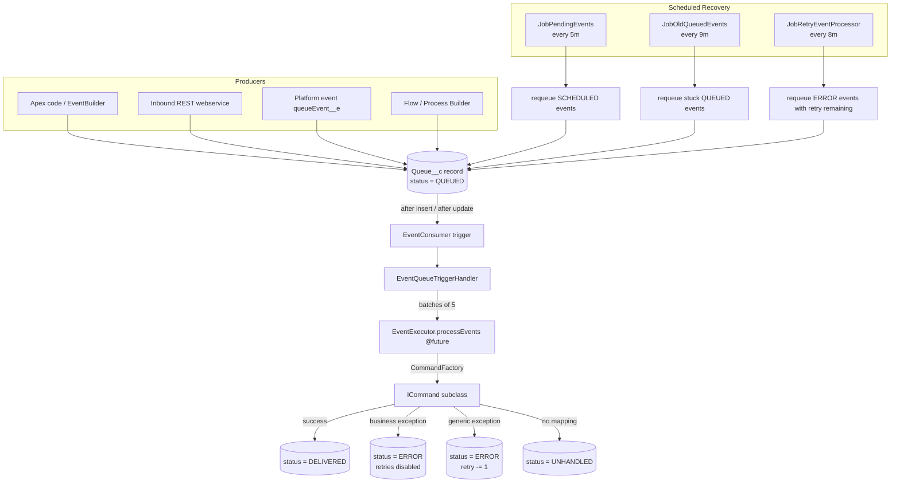
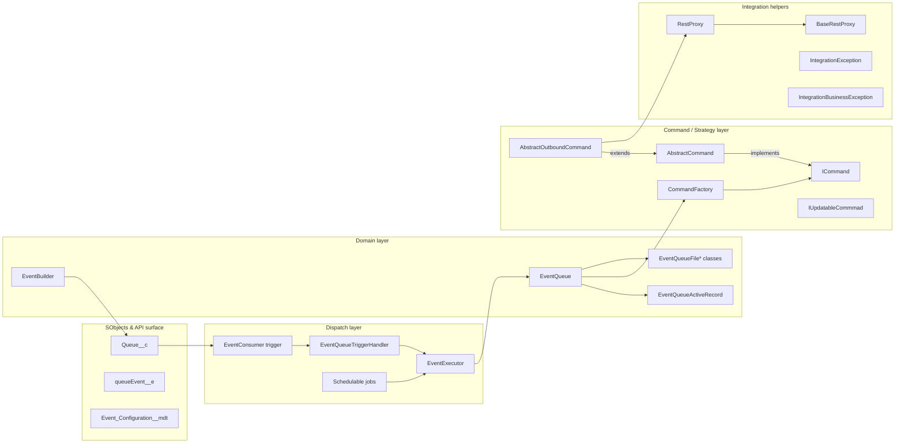
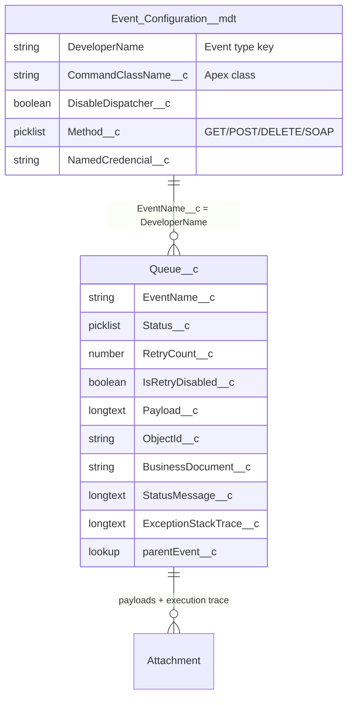

# Architecture Overview

## Purpose

The Event Queue is an asynchronous execution framework built on top of a
single custom object, `Queue__c`. Each record of `Queue__c` represents one
unit of asynchronous work — a "command" to execute. When a record is saved
in the `QUEUED` status, the framework dispatches it to a configured Apex
class, runs it off the user's transaction, and persists the outcome
(success, delivered, error, unhandled) on the same record.

The aim is three-fold:

1. **Performance through asynchrony** — critical work (emails, callouts,
   inbound/outbound integrations) never blocks the UI or synchronous
   user transaction.
2. **Preemptive customer support** — every execution leaves a trace
   (stack trace, status message, processing log attachment), so failures
   can be diagnosed without reproducing the issue.
3. **Override & extension** — each Event Type is mapped to a class via
   custom metadata, so a downstream org can replace or decorate any
   mapped process without modifying the packaged code.

## High-level diagram

## Two entry points for execution

There are **two** paths that move a `Queue__c` record from `QUEUED` to a
terminal status:

1. **Synchronous trigger path** — `EventConsumer` fires on
   `after insert`/`after update` of `Queue__c`. For records in
   `QUEUED` status it calls `EventExecutor.processEvents(...)` as a
   `@future(callout=true)` method, batched in groups of five
   (`EventExecutor.FUTURE_CALL_SIZE`).
2. **Scheduled retry path** — three `Schedulable` classes
   (`JobPendingEvents`, `JobOldQueuedEvents`, `JobRetryEventProcessor`)
   are bootstrapped at install time via
   `ScheduleHelper.scheduleIntoMinutesInterval`. They look for events
   stuck in `SCHEDULED`, old `QUEUED`, or failed `ERROR` state and
   push them back into `QUEUED`, which retriggers the consumer.

Both paths ultimately run `EventQueue.process()`, which looks up the
mapped command class via `Event_Configuration__mdt` and delegates
execution.

## Layering

| Layer | Classes | Responsibility |
| --- | --- | --- |
| SObjects | `Queue__c`, `queueEvent__e`, `Event_Configuration__mdt` | Persistence + configuration. |
| Dispatch | `EventConsumer`, `EventQueueTriggerHandler`, `EventExecutor`, `JobPendingEvents`, `JobOldQueuedEvents`, `JobRetryEventProcessor`, `ScheduleHelper` | Move records between states, honour governor limits. |
| Domain | `EventQueue`, `EventQueueActiveRecord`, `EventBuilder`, `EventQueueFile*` | OO wrapper around `Queue__c`, SOQL/DML, attachment storage. |
| Command / Strategy | `ICommand`, `IUpdatableCommmad`, `AbstractCommand`, `AbstractOutboundCommand`, `CommandFactory` | Pluggable business logic. |
| Integration | `BaseRestProxy`, `RestProxy`, `IntegrationException`, `IntegrationBusinessException`, `IntegrationBusError` | Outbound HTTP, named credentials, typed errors. |

## Execution lifecycle (in one sentence)

> Producer → `Queue__c` row with `status = QUEUED` → trigger /
> scheduler → `EventExecutor` → `EventQueue.process()` →
> `CommandFactory.createInstanceFor(config.CommandClassName__c)` →
> `ICommand.execute(event)` → persist outcome → post-update DMLs if
> command is `IUpdatableCommmad` → attach processing log as `Attachment`.

The same lifecycle is walked through field-by-field in
[execution-flows.md](./execution-flows.md).

## Two object types, one reason

The framework owns two event-shaped objects:

- `Queue__c` — **the persisted event**. Durable, updatable, indexed, the
  source of truth for retries and support.
- `queueEvent__e` — **a platform event**. High-volume, fire-and-forget,
  used as an ingress channel when producers can't (or shouldn't) commit
  DML on `Queue__c` synchronously.

`queueProcessor.trigger` is the subscriber for `queueEvent__e` but the
packaged version is **empty** — it's a placeholder extension point.
The typical integration of `queueEvent__e` into the framework is: a
subscriber trigger translates the platform event into a `Queue__c`
`QUEUED` row, and the normal dispatch takes over. See
[usage/platform-events.md](../usage/platform-events.md).

## Configuration model

## Key conventions

- **Event Type naming** — upper snake case (`BOOK_INBOUND_SERVICE`,
  `SMS_OUTBOUND_SERVICE`). The `EventType` Apex enum is a registry of
  supported event types; the `Event_Configuration__mdt.DeveloperName`
  must match the enum name (the README calls this out).
- **Status lifecycle** — only a subset of `EventQueueStatusType` values
  are actually used as transient states in the pipeline. The picklist
  on `Queue__c.Status__c` is also narrower than the enum. See
  [../reference/status-lifecycle.md](../reference/status-lifecycle.md).
- **Payload storage** — payloads (inbound, outbound request, outbound
  response, full execution log) are stored as **Attachment** records on
  the parent `Queue__c`. The inline `Payload__c` field is used only as
  an input channel and is cleared on save.
- **Sharing & access** — class-level `with sharing` is consistently
  used. The package ships two permission sets:
  `Event_Queue_Admin` (full) and `Event_Queue_Running_User` (execution
  context for scheduled jobs / integration users).

See [design-patterns.md](./design-patterns.md) for how these choices
map to classic GoF / enterprise patterns, and
[execution-flows.md](./execution-flows.md) for every flow drawn as a
sequence diagram.
