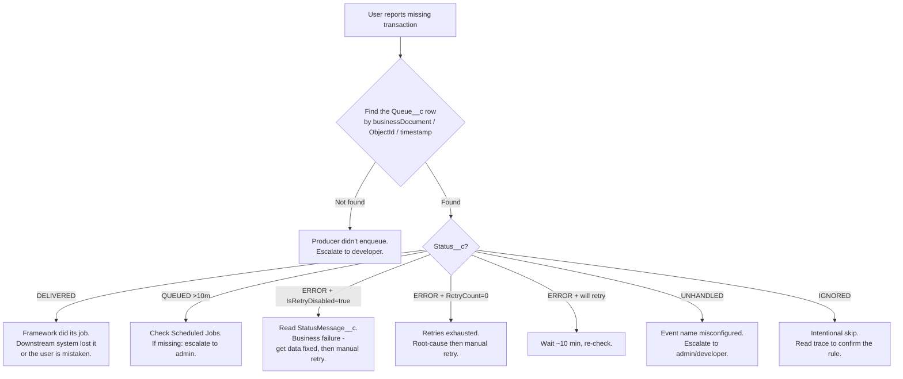

# Persona: Support / Ops

You're the first responder when a business user reports "my order
didn't go through" or "the external system never got the update". You
don't write Apex, but you can use the Developer Console, read a
stack trace, and run Execute Anonymous snippets.

## Mental model in one minute

Every unit of async work is a row on the **Event Queue** tab
(`Queue__c`). If something went wrong, the row is still there —
with its status, error message, stack trace, and attachments
describing what happened. Nothing is lost.

- `DELIVERED` → all good.
- `ERROR` + retryable → the scheduler will try again soon.
- `ERROR` + not retryable → it needs you.
- `QUEUED` for a long time → something stuck; the scheduler's
  safety-net job should push it again.
- `UNHANDLED` → the event name isn't configured. That's an admin/
  developer issue.

## Your primary tools

- **Event Queue tab** (the `Queue__c` list).
- **Execute Anonymous** (Developer Console → Debug).
- **Scheduled Jobs** (Setup → Scheduled Jobs).
- **Attachment related list** on a `Queue__c` record.

## Triage cheat sheet



## Finding the event

By business document number:

```apex
for (Queue__c q : [
    SELECT Name, EventName__c, Status__c, StatusMessage__c,
           RetryCount__c, IsRetryDisabled__c, CreatedDate
    FROM Queue__c
    WHERE businessDocument__c = 'ORDER-12345'
    ORDER BY CreatedDate DESC
]) {
    System.debug(q);
}
```

By Salesforce record Id:

```apex
for (Queue__c q : [
    SELECT Name, EventName__c, Status__c, StatusMessage__c, CreatedDate
    FROM Queue__c
    WHERE ObjectId__c = '001...'
    ORDER BY CreatedDate DESC
]) {
    System.debug(q);
}
```

## Reading a failure

On the record page, look at:

1. **Status Message** — the human-readable error.
2. **Exception Stack Trace** — where in Apex it blew up.
3. **Attachments** (Files/Notes & Attachments related list):
   - `ExecutionTrace_<timestamp>_<bizdoc>.txt` — all log lines the
     command emitted. This is almost always the most useful file.
   - `REQUEST_PAYLOAD_<timestamp>.txt` — what we sent out (if
     outbound).
   - `RESPONSE_PAYLOAD_<timestamp>.txt` — what the other side replied.

Download the `ExecutionTrace_*` attachment and read it top-to-bottom;
you'll usually spot the cause in the log lines.

## Manual retry (one record)

```apex
Queue__c q = [SELECT Id FROM Queue__c WHERE Name = 'Q-0000001234'];
q.Status__c = 'QUEUED';
q.RetryCount__c = 10;
q.IsRetryDisabled__c = false;
update q;
```

The `EventConsumer` trigger fires on `after update`, so the
dispatcher picks it up within seconds.

## Manual retry (bulk)

```apex
List<Queue__c> rows = [
    SELECT Id
    FROM Queue__c
    WHERE Status__c = 'ERROR'
      AND EventName__c = 'SMS_OUTBOUND_SERVICE'
      AND CreatedDate = TODAY
];
EventExecutor.reprocess(rows);
```

`EventExecutor.reprocess(List<Queue__c>)` flips each row to
`QUEUED` and bulk-updates. The trigger then fires.

## Check the scheduled jobs

```apex
for (CronTrigger ct : [
    SELECT CronJobDetail.Name, State, NextFireTime, PreviousFireTime
    FROM CronTrigger
    WHERE CronJobDetail.Name LIKE 'Job%'
    ORDER BY CronJobDetail.Name
]) {
    System.debug(ct.CronJobDetail.Name + ' -> next=' + ct.NextFireTime);
}
```

Expected: ~27 rows (12 for `JobPendingEvents`, 7 for
`JobOldQueuedEvents`, 8 for `JobRetryEventProcessor`). If you see
zero rows → escalate to the admin.

## Common messages and what they mean

| `StatusMessage__c` starts with | Meaning | First action |
| --- | --- | --- |
| `System.NullPointerException` | Code hit a null. | Escalate to developer with the stack trace. |
| `System.CalloutException: Read timed out` | External system slow. | Wait and let the retry loop handle it. If persistent, escalate. |
| `IntegrationException: Invalid Named Credential` | Admin missed a Named Credential. | Escalate to admin. |
| `IntegrationException: 4xx : ...` | External system rejected the payload. | Read the response body. Usually bad data — fix and retry. |
| `IntegrationBusinessException: ...` | Business rule failure (explicit). | Read the message. Usually needs data change in the producer org or a decision. |
| `System.LimitException: Too many future calls` | Producer enqueued too many events. | Escalate to developer. |

## When to escalate

| Symptom | Escalate to |
| --- | --- |
| No `Queue__c` row exists for the reported transaction. | Developer (producer didn't enqueue). |
| `UNHANDLED` status. | Admin first (missing metadata), then developer. |
| Scheduled jobs all missing from Setup → Scheduled Jobs. | Admin. |
| Same error repeated across many events today. | Developer + admin. Might be a downstream outage or a recent deploy regression. |
| Stack trace includes class names you don't recognise and the message is cryptic. | Developer. |

## Safety rules

- ❌ Never delete a `Queue__c` row in production. It's your only
  record of what happened. The web link `Delete` is there because
  the object inherits the standard action — don't click it.
- ❌ Never flip `IsRetryDisabled__c` from true to false unless you
  understand **why** the command disabled it. Something marked as
  non-retryable was marked so deliberately.
- ✅ Always read the `ExecutionTrace_*` attachment before deciding an
  event is a lost cause.

## See also

- [../debugging.md](../debugging.md) — the full operational runbook.
- [../reference/status-lifecycle.md](../reference/status-lifecycle.md) — every status value.
