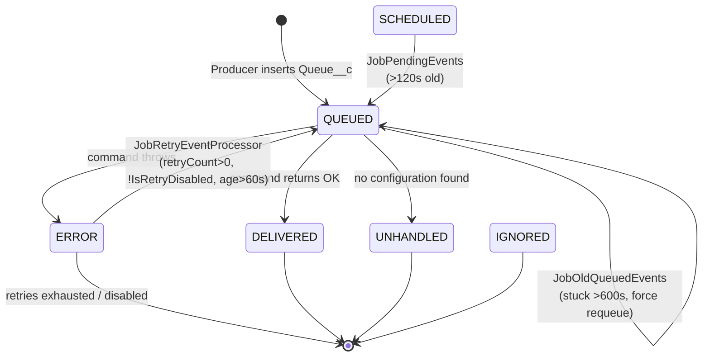

# Status Lifecycle

`Queue__c.Status__c` is a picklist, and `EventQueueStatusType` is an
Apex enum. They **do not overlap completely** — this page is the
canonical map of what each value means and who can set it.

## Picklist values (declared on `Queue__c.Status__c`)

| Value | Meaning | Set by |
| --- | --- | --- |
| `QUEUED` | Ready for dispatch. | Producer (`EventBuilder`, Flow, REST, retry jobs). |
| `DELIVERED` | Command returned without throwing. | `EventQueue.successfullyDeliveryEvent()` |
| `ERROR` | Command threw. Retry may or may not be disabled. | `EventQueue.errorProcessingEvent(Exception)` |
| `SUCCESS` | Legacy terminal status. | `EventQueue.successfullyProcessedEvent()` — callable but not used by the packaged dispatcher. |
| `UNHANDLED` | No `Event_Configuration__mdt` mapping for this event name. | `EventQueue.setToUnhandledEvent()` |
| `INVALID` | Reserved for validation failures. Not currently set. | — |
| `DONE` | Reserved. Not currently set. | — |
| `PROCESSING` | Reserved. Not currently set. | — |
| `BATCH` | Reserved. Not currently set. | — |

## Enum values (declared on `EventQueueStatusType`)

The enum is broader than the picklist. Values beyond the picklist are
referenced in code paths that are not used by the default dispatcher
(or are dead code). They exist to allow custom commands to park
events in intermediate states without inventing strings.

| Value | On picklist? | Referenced in code | Intended meaning |
| --- | --- | --- | --- |
| `SUCCESS` | yes | `successfullyProcessedEvent()` | Legacy alias for `DELIVERED`. |
| `ERROR` | yes | `hasError`, `findEventsWithError`, `errorProcessingEvent` | Execution failure. |
| `QUEUED` | yes | `hasQueuedEventsForBusinessDocument`, `reprocess`, `EventBuilder.createEventBaseOn` | Ready for dispatch. |
| `DEQUEUED` | no | — | Reserved. |
| `DELIVERED` | yes | `successfullyDeliveryEvent` | Happy path terminal state. |
| `INVALID` | yes | — | Reserved (schema validation failures). |
| `DONE` | yes | — | Reserved. |
| `WAITING_EXTERNAL_SYSTEM` | no | — | Intended for long-running async with an external wait. |
| `QUEUED_ON_EXTERNAL_SYSTEM` | no | — | Intended for events that handed off to an external queue. |
| `EMPTY` | no | — | Reserved. |
| `OVERRIDDEN` | no | — | Reserved. |
| `UNHANDLED` | yes | `setToUnhandledEvent`, `hasHandlerFor` check | Dispatcher could not resolve a command. |
| `WORKFLOW` | no | `EventExecutor.execute(QueueableContext)` | Used when dispatching via `Queueable` rather than trigger. |
| `PROCESSING` | yes | — | Reserved. |
| `SCHEDULED` | no | `JobPendingEvents` via `PENDING_EVENTS` constant | Event scheduled for later processing. |
| `BATCH` | yes | — | Reserved (bulk/batch path). |
| `WAITING` | no | — | Reserved. |
| `IGNORED` | no | `isIgnored`, skip logic in `postExecute` and `process` when `DisableDispatcher__c = true` | Command (or the kill switch) decided the event should be skipped without error. |

## State diagram (the actual transitions)

## Operational rules of thumb

- If an event is in `ERROR` **and** `IsRetryDisabled = true` → the
  retry loop will never touch it. Human intervention required.
- If an event is in `ERROR` **and** `RetryCount = 0` → same.
- If an event is in `QUEUED` for more than 10 minutes → the retry
  loop will push it back. In practice this means the original trigger
  call failed (platform limits, unhandled exception) and the
  `JobOldQueuedEvents` job is the safety net.
- If an event is in `UNHANDLED` → check the `EventName__c` matches an
  `Event_Configuration__mdt.DeveloperName` exactly (case-sensitive
  label).
- If an event is stuck in a non-picklist enum value (e.g.
  `WAITING_EXTERNAL_SYSTEM`) → either a custom command parked it
  there, or there's a data-integrity bug (the picklist restrict
  setting is `false` so any string is accepted on direct DML).

## "How do I retry an event manually?"

See [../debugging.md](../debugging.md#manual-retry).

## Reference links

- Lifecycle enum definition: `force-app/main/default/classes/EventQueueStatusType.cls`
- Picklist definition: `force-app/main/default/objects/Queue__c/fields/Status__c.field-meta.xml`
- Retry job: `JobRetryEventProcessor.cls` → `EventExecutor.processErrorEvents`
- Stuck-event job: `JobOldQueuedEvents.cls` → `EventExecutor.processOldQueuedEvents`
- Scheduled-state job: `JobPendingEvents.cls` → `EventExecutor.processPendingEvents`
