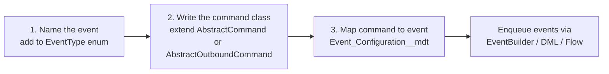

# Implementing a Command

A command is a class that extends `AbstractCommand` (or
`AbstractOutboundCommand`) — or implements `ICommand` directly — and
is mapped to an Event Type via `Event_Configuration__mdt`.

## The three-step loop



## Scenario 1 — Local logic (no callout)

Extend `AbstractCommand`:

```apex
public with sharing class WelcomeEmailCommand extends AbstractCommand {

    private Contact contact;

    override public void init(EventQueue event) {
        super.init(event);
        contact = (Contact) event.getPayloadFromJson(Contact.class);
        event.appendLog('Contact deserialised: ' + contact.Id);
    }

    override public void execute() {
        Messaging.SingleEmailMessage msg = new Messaging.SingleEmailMessage();
        msg.setTargetObjectId(contact.Id);
        msg.setTemplateId(TemplateProvider.WELCOME_ID);
        msg.setSaveAsActivity(true);
        Messaging.sendEmail(new Messaging.SingleEmailMessage[]{ msg });
    }
}
```

Then register:

```xml
<!-- force-app/main/default/customMetadata/Event_Configuration.WELCOME_EMAIL_SERVICE.md-meta.xml -->
<CustomMetadata ...>
    <label>WELCOME_EMAIL_SERVICE</label>
    <values><field>CommandClassName__c</field><value xsi:type="xsd:string">WelcomeEmailCommand</value></values>
    <values><field>DisableDispatcher__c</field><value xsi:type="xsd:boolean">false</value></values>
</CustomMetadata>
```

Enqueue:

```apex
new EventBuilder()
    .createEventFor('WELCOME_EMAIL_SERVICE')
    .withPayload(JSON.serialize(contact))
    .buildAndSave();
```

## Scenario 2 — Outbound HTTP (simple)

Extend `AbstractOutboundCommand` and implement the two abstract
methods:

```apex
public with sharing class SmsOutboundCommand extends AbstractOutboundCommand {

    override global Object tranformToSend() {
        SmsPayload p = (SmsPayload) event.getPayloadFromJson(SmsPayload.class);
        return new SmsProviderRequest(p.to, p.body);
    }

    override global void processResult(Object responseObject) {
        String body = (String) responseObject; // proxy returns the raw body
        SmsProviderResponse r = (SmsProviderResponse) JSON.deserialize(body, SmsProviderResponse.class);

        if (!r.success) {
            throw new IntegrationBusinessException(
                new IntegrationBusError(r.errorCode, r.errorMessage)
            );
        }

        event.appendLog('SMS sent, providerMessageId=' + r.providerMessageId);
    }
}
```

`Event_Configuration__mdt`:

| Field | Value |
| --- | --- |
| `CommandClassName__c` | `SmsOutboundCommand` |
| `Method__c` | `POST` |
| `NamedCredencial__c` | `SmsProvider` |

The base class handles:

- Building the `RestProxy` from the Named Credential.
- Logging `REQUEST_PAYLOAD_<now>` and `RESPONSE_PAYLOAD_<now>`
  attachments.
- Retrying the callout up to 3 times on `CalloutException`.
- Converting non-2xx responses into `IntegrationException`.

## Scenario 3 — Callout **then** DML (two-phase)

When the callout response dictates a field update, split the work
using `IUpdatableCommmad`:

```apex
public with sharing class BookOutboundCommand extends AbstractOutboundCommand
                                                implements IUpdatableCommmad {

    private Booking booking;
    private BookResponse response;

    override global void init(EventQueue event) {
        super.init(event);
        booking = (Booking) event.getPayloadFromJson(Booking.class);
    }

    override global Object tranformToSend() {
        return new BookRequest(booking);
    }

    override global void processResult(Object responseObject) {
        // Only parse here; don't do DML in the callout phase.
        response = (BookResponse) JSON.deserialize((String) responseObject, BookResponse.class);
    }

    public void postUpdateExecute(EventQueue event) {
        // Safe to DML now — this runs after all callouts are done.
        update new Booking__c(
            Id = booking.Id,
            External_Ref__c = response.reference,
            Status__c = response.status
        );
    }
}
```

> `postUpdateExecute` is called by
> `EventExecutor.processEvents(...)` after **all** events in the
> batch have finished their callouts. This lets Apex batch DML and
> keeps the callouts-before-DML rule.

## Scenario 4 — You want to skip an event

Set status to `IGNORED` inside your command. The framework will skip
`postExecute` and won't mark the event `DELIVERED`:

```apex
override public void execute() {
    if (event.get().isRetryDisabled__c /* or some business check */) {
        event.setStatus(EventQueueStatusType.IGNORED.name());
        event.appendLog('Ignored: no-op rule matched');
        return;
    }
    // ... real work
}
```

## Scenario 5 — Custom HTTP behaviour

To inject an OAuth token, add headers, or customise retry, subclass
the proxy and override `getHttpRequestProxy` in your command:

```apex
public class OauthRestProxy extends RestProxy {
    public OauthRestProxy(EventQueue event) { super(event); }

    override public void setup() {
        super.setup();
        httpRequest.setHeader('Authorization', 'Bearer ' + Auth.tokenFor(event));
    }
}

public class MyCommand extends AbstractOutboundCommand {
    override global BaseRestProxy getHttpRequestProxy(EventQueue event) {
        return new OauthRestProxy(event);
    }
    // ... tranformToSend / processResult
}
```

## Signalling failure

| Kind | Throw | Effect |
| --- | --- | --- |
| Business (non-retryable) | `IntegrationBusinessException(new IntegrationBusError(code, msg))` | Status → `ERROR`, `IsRetryDisabled = true`. |
| Technical (retryable) | `IntegrationException(httpResponse)` or any `Exception` | Status → `ERROR`, `RetryCount -= 1`. |
| Non-error skip | `event.setStatus('IGNORED')` and return | Status → `IGNORED`. No retry. |

## Writing tests

Mirror `EventQueueTest` / `AbstractOutboundCommandTest`:

```apex
@isTest
private class SmsOutboundCommandTest {
    @isTest
    static void givenSuccess_thenDelivered() {
        Test.setMock(HttpCalloutMock.class, new HttpMock('{"success":true,"providerMessageId":"abc"}', true));

        EventQueue evt = EventQueueFixtureFactory.createBaseEvent('SMS_OUTBOUND_SERVICE');
        evt.setPayload(JSON.serialize(new SmsPayload('+15551234567', 'hi')));

        Test.startTest();
        evt.process();
        Test.stopTest();

        System.assertEquals('DELIVERED', evt.getStatus());
    }

    @isTest
    static void givenBusinessError_thenErrorNoRetry() {
        Test.setMock(HttpCalloutMock.class, new HttpMock('{"success":false,"errorCode":"BAD_NUMBER","errorMessage":"invalid"}', true));

        EventQueue evt = EventQueueFixtureFactory.createBaseEvent('SMS_OUTBOUND_SERVICE');
        evt.setPayload(JSON.serialize(new SmsPayload('', '')));

        Test.startTest();
        evt.process();
        Test.stopTest();

        System.assertEquals('ERROR', evt.getStatus());
        System.assertEquals(true, evt.get().IsRetryDisabled__c);
    }
}
```

## Do's and don'ts

✅ **Do** put deserialisation in `init()` and log the result.
✅ **Do** throw `IntegrationBusinessException` on permanent failures.
✅ **Do** use `event.appendLog(...)` liberally — every line ends up
   in the `ExecutionTrace_` attachment.
✅ **Do** make `processResult` pure (no DML) if your command might
   later need to become two-phase.

❌ **Don't** `insert` / `update` / `delete` inside `execute()` of an
   outbound command — Apex forbids DML before the callout completes.
   Use `IUpdatableCommmad` and put DML in `postUpdateExecute`.
❌ **Don't** swallow exceptions in your command; the framework relies
   on them to route to `ERROR`.
❌ **Don't** call `save()` yourself during command execution — the
   dispatcher bulk-saves at the end of the batch.
❌ **Don't** rely on `System.debug` alone — it's ephemeral. Use
   `event.appendLog()` so the trace is persisted as an attachment.
